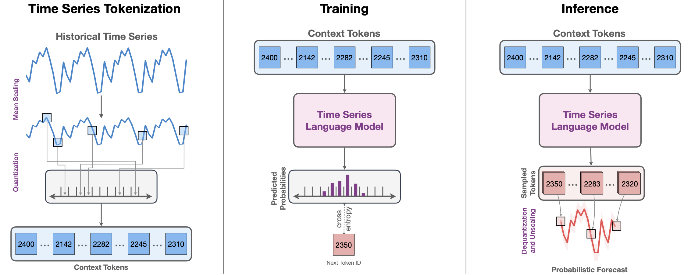
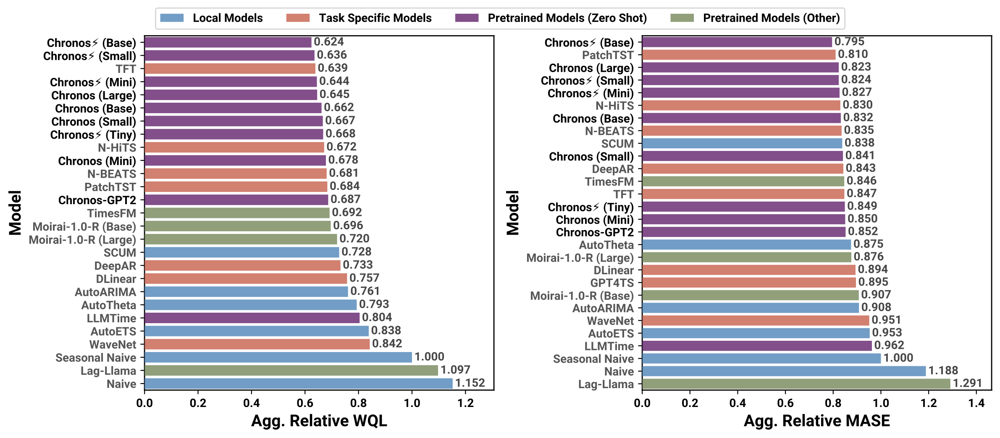

<div align="center">


# Chronos: Learning the Language of Time Series

[](https://arxiv.org/abs/2403.07815)
[](https://huggingface.co/datasets/autogluon/chronos_datasets)
[](https://huggingface.co/collections/amazon/chronos-models-65f1791d630a8d57cb718444)
[](https://github.com/amazon-science/chronos-forecasting/issues?q=is%3Aissue+label%3AFAQ)
[](https://opensource.org/licenses/Apache-2.0)
</div>

## 🚀 News

- **27 June 2024**: 🚀 [Released datasets](https://huggingface.co/datasets/autogluon/chronos_datasets) used in the paper and an [evaluation script](./scripts/README.md#evaluating-chronos-models) to compute the WQL and MASE scores reported in the paper. 
- **17 May 2024**: 🐛 Fixed an off-by-one error in bin indices in the `output_transform`. This simple fix significantly improves the overall performance of Chronos. We will update the results in the next revision on ArXiv.
- **10 May 2024**: 🚀 We added the code for pretraining and fine-tuning Chronos models. You can find it in [this folder](./scripts/training). We also added [a script](./scripts/kernel-synth.py) for generating synthetic time series data from Gaussian processes (KernelSynth; see Section 4.2 in the paper for details). Check out the [usage examples](./scripts/).
- **19 Apr 2024**: 🚀 Chronos is now supported on [AutoGluon-TimeSeries](https://auto.gluon.ai/stable/tutorials/timeseries/index.html), the powerful AutoML package for time series forecasting which enables model ensembles, cloud deployments, and much more. Get started with the [tutorial](https://auto.gluon.ai/stable/tutorials/timeseries/forecasting-chronos.html).
- **08 Apr 2024**: 🧪 Experimental [MLX inference support](https://github.com/amazon-science/chronos-forecasting/tree/mlx) added. If you have an Apple Silicon Mac, you can now obtain significantly faster forecasts from Chronos compared to CPU inference. This provides an alternative way to exploit the GPU on your Apple Silicon Macs together with the "mps" support in PyTorch.
- **25 Mar 2024**: 🚀 [v1.1.0 released](https://github.com/amazon-science/chronos-forecasting/releases/tag/v1.1.0) with inference optimizations and `pipeline.embed` to extract encoder embeddings from Chronos.
- **13 Mar 2024**: 🚀 Chronos [paper](https://arxiv.org/abs/2403.07815) and inference code released.

## ✨ Introduction

Chronos is a family of **pretrained time series forecasting models** based on language model architectures. A time series is transformed into a sequence of tokens via scaling and quantization, and a language model is trained on these tokens using the cross-entropy loss. Once trained, probabilistic forecasts are obtained by sampling multiple future trajectories given the historical context. Chronos models have been trained on a large corpus of publicly available time series data, as well as synthetic data generated using Gaussian processes.

For details on Chronos models, training data and procedures, and experimental results, please refer to the paper [Chronos: Learning the Language of Time Series](https://arxiv.org/abs/2403.07815).

<p align="center">
  
  <br />
  <span>
    Fig. 1: High-level depiction of Chronos. (<b>Left</b>) The input time series is scaled and quantized to obtain a sequence of tokens. (<b>Center</b>) The tokens are fed into a language model which may either be an encoder-decoder or a decoder-only model. The model is trained using the cross-entropy loss. (<b>Right</b>) During inference, we autoregressively sample tokens from the model and map them back to numerical values. Multiple trajectories are sampled to obtain a predictive distribution.
  </span>
</p>

### Architecture

The models in this repository are based on the [T5 architecture](https://arxiv.org/abs/1910.10683). The only difference is in the vocabulary size: Chronos-T5 models use 4096 different tokens, compared to 32128 of the original T5 models, resulting in fewer parameters.

<div align="center">

| Model                                                                  | Parameters | Based on                                                               |
| ---------------------------------------------------------------------- | ---------- | ---------------------------------------------------------------------- |
| [**chronos-t5-tiny**](https://huggingface.co/amazon/chronos-t5-tiny)   | 8M         | [t5-efficient-tiny](https://huggingface.co/google/t5-efficient-tiny)   |
| [**chronos-t5-mini**](https://huggingface.co/amazon/chronos-t5-mini)   | 20M        | [t5-efficient-mini](https://huggingface.co/google/t5-efficient-mini)   |
| [**chronos-t5-small**](https://huggingface.co/amazon/chronos-t5-small) | 46M        | [t5-efficient-small](https://huggingface.co/google/t5-efficient-small) |
| [**chronos-t5-base**](https://huggingface.co/amazon/chronos-t5-base)   | 200M       | [t5-efficient-base](https://huggingface.co/google/t5-efficient-base)   |
| [**chronos-t5-large**](https://huggingface.co/amazon/chronos-t5-large) | 710M       | [t5-efficient-large](https://huggingface.co/google/t5-efficient-large) |

</div>

### Zero-Shot Results

The following figure showcases the remarkable **zero-shot** performance of Chronos models on 27 datasets against local models, task-specific models and other pretrained models. For details on the evaluation setup and other results, please refer to [the paper](https://arxiv.org/abs/2403.07815). 

<p align="center">
  
  <br />
  <span>
    Fig. 2: Performance of different models on Benchmark II, comprising 27 datasets <b>not seen</b> by Chronos models during training. This benchmark provides insights into the zero-shot performance of Chronos models against local statistical models, which fit parameters individually for each time series, task-specific models <i>trained on each task</i>, and pretrained models trained on a large corpus of time series. Pretrained Models (Other) indicates that some (or all) of the datasets in Benchmark II may have been in the training corpus of these models. The probabilistic (WQL) and point (MASE) forecasting metrics were normalized using the scores of the Seasonal Naive baseline and aggregated through a geometric mean to obtain the Agg. Relative WQL and MASE, respectively.
  </span>
</p>

## 📈 Usage

To perform inference with Chronos models, install this package by running:

```
pip install git+https://github.com/amazon-science/chronos-forecasting.git
```
> [!TIP]  
> The recommended way of using Chronos for production use cases is through [AutoGluon](https://auto.gluon.ai), which features ensembling with other statistical and machine learning models for time series forecasting as well as seamless deployments on AWS with SageMaker 🧠. Check out the AutoGluon Chronos [tutorial](https://auto.gluon.ai/stable/tutorials/timeseries/forecasting-chronos.html).

### Forecasting

A minimal example showing how to perform forecasting using Chronos models:

```python
import pandas as pd  # requires: pip install pandas
import torch
from chronos import ChronosPipeline

pipeline = ChronosPipeline.from_pretrained(
    "amazon/chronos-t5-small",
    device_map="cuda",  # use "cpu" for CPU inference and "mps" for Apple Silicon
    torch_dtype=torch.bfloat16,
)

df = pd.read_csv("https://raw.githubusercontent.com/AileenNielsen/TimeSeriesAnalysisWithPython/master/data/AirPassengers.csv")

# context must be either a 1D tensor, a list of 1D tensors,
# or a left-padded 2D tensor with batch as the first dimension
# forecast shape: [num_series, num_samples, prediction_length]
forecast = pipeline.predict(
    context=torch.tensor(df["#Passengers"]),
    prediction_length=12,
    num_samples=20,
)
```

More options for `pipeline.predict` can be found with:

```python
print(ChronosPipeline.predict.__doc__)
```

We can now visualize the forecast:

```python
import matplotlib.pyplot as plt  # requires: pip install matplotlib
import numpy as np

forecast_index = range(len(df), len(df) + 12)
low, median, high = np.quantile(forecast[0].numpy(), [0.1, 0.5, 0.9], axis=0)

plt.figure(figsize=(8, 4))
plt.plot(df["#Passengers"], color="royalblue", label="historical data")
plt.plot(forecast_index, median, color="tomato", label="median forecast")
plt.fill_between(forecast_index, low, high, color="tomato", alpha=0.3, label="80% prediction interval")
plt.legend()
plt.grid()
plt.show()
```

### Extracting Encoder Embeddings

A minimal example showing how to extract encoder embeddings from Chronos models:

```python
import pandas as pd
import torch
from chronos import ChronosPipeline

pipeline = ChronosPipeline.from_pretrained(
    "amazon/chronos-t5-small",
    device_map="cuda",
    torch_dtype=torch.bfloat16,
)

df = pd.read_csv("https://raw.githubusercontent.com/AileenNielsen/TimeSeriesAnalysisWithPython/master/data/AirPassengers.csv")

# context must be either a 1D tensor, a list of 1D tensors,
# or a left-padded 2D tensor with batch as the first dimension
context = torch.tensor(df["#Passengers"])
embeddings, tokenizer_state = pipeline.embed(context)
```

### Pretraining, fine-tuning and evaluation

Scripts for pretraining, fine-tuning and evaluating Chronos models can be found in [this folder](./scripts/).

## :floppy_disk: Datasets

Datasets used in the Chronos paper for pretraining and evaluation (both in-domain and zero-shot) are available through the HuggingFace repos: [`autogluon/chronos_datasets`](https://huggingface.co/datasets/autogluon/chronos_datasets) and [`autogluon/chronos_datasets_extra`](https://huggingface.co/datasets/autogluon/chronos_datasets_extra). Check out these repos for instructions on how to download and use the datasets.

## 🔥 Coverage

- [Adapting language model architectures for time series forecasting](https://www.amazon.science/blog/adapting-language-model-architectures-for-time-series-forecasting) (Amazon Science blog post)
- [Amazon AI Researchers Introduce Chronos: A New Machine Learning Framework for Pretrained Probabilistic Time Series Models](https://www.marktechpost.com/2024/03/15/amazon-ai-researchers-introduce-chronos-a-new-machine-learning-framework-for-pretrained-probabilistic-time-series-models/) (Marktechpost blog post)
- [Chronos: The Rise of Foundation Models for Time Series Forecasting](https://towardsdatascience.com/chronos-the-rise-of-foundation-models-for-time-series-forecasting-aaeba62d9da3) (Towards Data Science blog post by Luís Roque and Rafael Guedes)
- [Moirai: Time Series Foundation Models for Universal Forecasting](https://towardsdatascience.com/moirai-time-series-foundation-models-for-universal-forecasting-dc93f74b330f) (Towards Data Science blog post by Luís Roque and Rafael Guedes, includes comparison of Chronos with Moirai)
- [Chronos: The Latest Time Series Forecasting Foundation Model by Amazon](https://towardsdatascience.com/chronos-the-latest-time-series-forecasting-foundation-model-by-amazon-2687d641705a) (Towards Data Science blog post by Marco Peixeiro)
  - The original article had a critical bug affecting the metric computation for Chronos. We opened a [pull request](https://github.com/marcopeix/time-series-analysis/pull/10) to fix it.
- [How to Effectively Forecast Time Series with Amazon's New Time Series Forecasting Model](https://towardsdatascience.com/how-to-effectively-forecast-time-series-with-amazons-new-time-series-forecasting-model-9e04d4ccf67e) (Towards Data Science blog post by Eivind Kjosbakken)
- [Chronos: Learning the Language of Time Series](https://minimizeregret.com/linked/2024/03/27/chronos-forecasting/) (Minimize Regret blog post by Tim Radtke)
- [Chronos: Another Zero-Shot Time Series Forecaster LLM](https://levelup.gitconnected.com/chronos-another-zero-shot-time-series-forecaster-llm-0e80753a7ad0) (Level Up Coding blog post by Level Up Coding AI TutorMaster)
- [Paper Review: Chronos: Learning the Language of Time Series](https://andlukyane.com/blog/paper-review-chronos) (Review by Andrey Lukyanenko)
- [Foundation Models for Forecasting: the Future or Folly?](https://insights.radix.ai/blog/foundation-models-for-forecasting-the-future-or-folly) (Blog post by Radix)
- [Learning the Language of Time Series with Chronos](https://medium.com/@ManueleCaddeo/learning-the-language-of-time-series-with-chronos-fea7d0fedde4) (Medium post by Manuele Caddeo)
- [The latest advancement in Time Series Forecasting from AWS: Chronos](https://medium.com/chat-gpt-now-writes-all-my-articles/the-latest-advancement-in-time-series-forecasting-from-aws-chronos-python-code-included-0205d01248f3) (Medium post by Abish Pius)
- [Decoding the Future: How Chronos Redefines Time Series Forecasting with the Art of Language](https://medium.com/@zamalbabar/decoding-the-future-how-chronos-redefines-time-series-forecasting-with-the-art-of-language-cecc2174e400) (Medium post by Zamal)
- [Comparison of Chronos against the SCUM ensemble of statistical models](https://github.com/Nixtla/nixtla/tree/main/experiments/amazon-chronos) (Benchmark by Nixtla)
  - We opened a [pull request](https://github.com/Nixtla/nixtla/pull/281) extending the analysis to 28 datasets (200K+ time series) and showing that **zero-shot** Chronos models perform comparably to this strong ensemble of 4 statistical models while being significantly faster on average. Our complete response can be [found here](https://www.linkedin.com/pulse/extended-comparison-chronos-against-statistical-ensemble-ansari-4aste/).
- [Comparison of Chronos against a variety of forecasting models](https://www.linkedin.com/feed/update/urn:li:activity:7178398371815051267/) (Benchmark by ReadyTensor)

## 📝 Citation

If you find Chronos models useful for your research, please consider citing the associated [paper](https://arxiv.org/abs/2403.07815):

```
@article{ansari2024chronos,
  author  = {Ansari, Abdul Fatir and Stella, Lorenzo and Turkmen, Caner and Zhang, Xiyuan and Mercado, Pedro and Shen, Huibin and Shchur, Oleksandr and Rangapuram, Syama Syndar and Pineda Arango, Sebastian and Kapoor, Shubham and Zschiegner, Jasper and Maddix, Danielle C. and Wang, Hao and Mahoney, Michael W. and Torkkola, Kari and Gordon Wilson, Andrew and Bohlke-Schneider, Michael and Wang, Yuyang},
  title   = {Chronos: Learning the Language of Time Series},
  journal = {arXiv preprint arXiv:2403.07815},
  year    = {2024}
}
```

## 🛡️ Security

See [CONTRIBUTING](CONTRIBUTING.md#security-issue-notifications) for more information.

## 📃 License

This project is licensed under the Apache-2.0 License.
